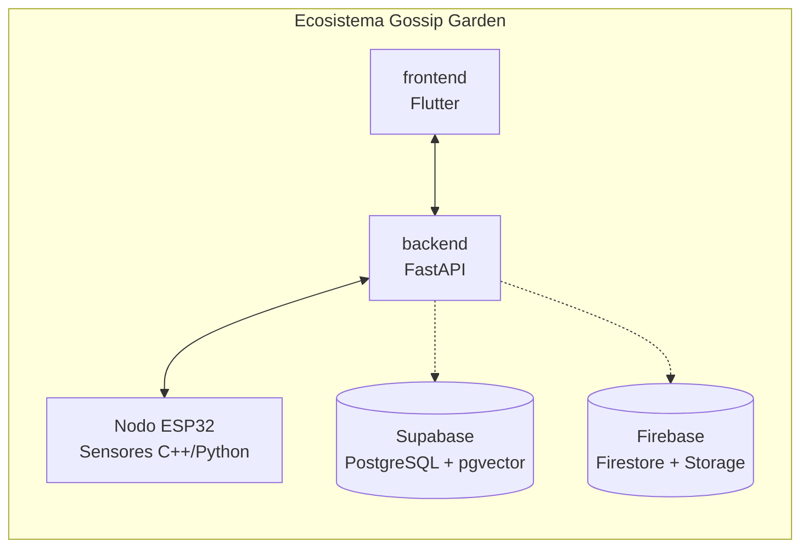
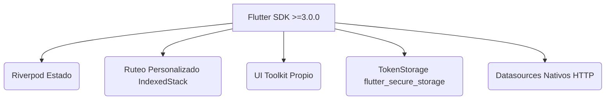
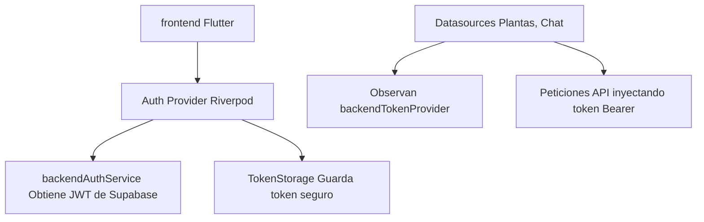

<div align="center">
  
  <h1>Gossip Garden Frontend</h1>
  <p><em>Una app móvil hermosa y lúdica para el cuidado de tus plantas.</em></p>

  <p>
    <a href="README.md">Read in English</a>
  </p>

  
  
  
  
</div>

---

## Tabla de Contenidos

1. [Visión General del Ecosistema](#1-visión-general-del-ecosistema)
2. [Qué hace Gossip Garden](#2-qué-hace-gossip-garden)
3. [Arquitectura](#3-arquitectura)
4. [Stack Tecnológico](#4-stack-tecnológico)
5. [Estructura del Proyecto](#5-estructura-del-proyecto)
6. [Módulos Principales](#6-módulos-principales)
7. [Integración API](#7-integración-api)
8. [Sistema de Diseño](#8-sistema-de-diseño)
9. [Ejecutar la Aplicación](#9-ejecutar-la-aplicación)
10. [Variables de Entorno](#10-variables-de-entorno)
11. [Construcción para Producción](#11-construcción-para-producción)

---

## 1. Visión General del Ecosistema

Gossip Garden es un ecosistema de monitoreo de plantas basado en IoT e IA, que consta de varios componentes interconectados:



| Componente | Rol |
|---|---|
| **frontend** | Aplicación principal de usuario construida en Flutter (este repositorio). |
| **backend** | Aplicación FastAPI que maneja la lógica de negocio, RAG y la orquestación de la IA. |
| **Nodo ESP32** | Sensor de hardware que transmite telemetría en tiempo real (humedad, luz, temperatura). |

---

## 2. Qué hace Gossip Garden

| Funcionalidad | Descripción |
|---|---|
| **Monitoreo en Tiempo Real** | Transmite la telemetría del sensor en vivo directamente al panel de la planta. |
| **IA Conversacional** | Las plantas tienen personalidades (ej. Tinto, Oblea). Los usuarios chatean contextualmente basándose en la salud actual de la planta. |
| **Identificación de Plantas** | Flujo de cámara que comprime imágenes y las sube para el análisis por IA y taxonomía GBIF en el backend. |
| **Puntuación de Salud** | Muestra indicadores visuales de salud de la planta, derivados de cálculos sobre condiciones óptimas vs actuales. |
| **Navegación Personalizada** | Utiliza un `IndexedStack` para preservar el estado local de cada pestaña, evitando el ruteo tradicional. |

---

## 3. Arquitectura

### Cliente



### Flujo de Datos



---

## 4. Stack Tecnológico

### Framework

| Capa | Tecnología |
|---|---|
| Framework | Flutter |
| Lenguaje | Dart |
| Manejo de Estado | flutter_riverpod ^2.0.0 |
| Inyección de Dependencias | Riverpod |
| Enrutamiento | Custom `IndexedStack` |

### Paquetes Clave

| Paquete | Propósito |
|---|---|
| `flutter_riverpod` | Núcleo del manejo de estado e inyección de dependencias. |
| `firebase_auth` / `google_sign_in` | Autenticación de terceros (Google). |
| `flutter_secure_storage` | Almacenamiento seguro del token JWT del backend. |
| `http` / `dio` | Peticiones de red al backend FastAPI. |
| `camera` / `image_picker` | Integración de hardware para identificación de plantas. |
| `image` | Procesamiento y compresión de imágenes de manera local. |
| `google_fonts` | Tipografías (Quicksand, Nunito). |
| `flutter_animate` | Micro-animaciones para la interfaz. |

---

## 5. Estructura del Proyecto

```text
src/lib/
│
├── core/                             # Infraestructura compartida
│   ├── config/                       # Variables de entorno
│   ├── services/                     # Servicios bajo nivel (API, TokenStorage)
│   └── theme/                        # Tokens de diseño (Colores, Tipografía)
│
├── features/                         # Módulos organizados por funcionalidad
│   ├── auth/                         # Inicio de sesión, Registro
│   │   ├── data/                     # DTOs, Auth Services
│   │   └── presentation/             # Pantallas, Providers
│   │
│   └── plants/                       # Lógica principal de las plantas
│       ├── data/                     # Modelos, Repositorios
│       └── presentation/             # Dashboard, Chat, Vista del Jardín
│
├── widgets/                          # Componentes de interfaz compartidos
│
└── main.dart                         # Punto de entrada y manejo global de errores
```

---

## 6. Módulos Principales

### Ciclo de Vida Auth (`auth_provider.dart`)

Gestiona la sesión activa. Aunque las librerías de Firebase están presentes, se evade Firebase Auth como única fuente de la verdad para en su lugar utilizar el JWT de Supabase proporcionado directamente por el `backend_auth_service`.
Expone el `backendTokenProvider`, que es observado reactivamente por todos los datasources de la API.

### Navegación (`MainScreen.dart`)

En lugar de utilizar el ruteo convencional `Navigator.push`, la aplicación emplea un `IndexedStack` coordinado mediante un `NavigationNotifier` (Riverpod). Esto permite:
- Preservar el estado local de cada pestaña (Dashboard, Lista de Chats, Jardín).
- Superponer vistas exclusivas a pantalla completa (como el `PlantProfileScreen` o `PlantChatScreen`) de forma limpia.
- Controlar el comportamiento del botón físico "Atrás" a través de `PopScope`.

### Identificación de Plantas

Situado en la funcionalidad de `plants`, controla la captura de imágenes, corrección de orientación, compresión a un formato óptimo de 1024x1024, y su subida para el procesamiento inteligente por el backend.

---

## 7. Integración API

El frontend se conecta exclusivamente al servicio FastAPI de `backendGossipGarden`.

| Dominio | Protocolo | Rol |
|---|---|---|
| **Auth** | HTTP/REST | Emite JWTs de Supabase y maneja los inicios de sesión con Google. |
| **Plantas** | HTTP/REST | Carga perfiles de plantas, taxonomía y cuidados. |
| **Sensores** | HTTP/REST | Recibe datos de telemetría del nodo ESP32 en modo "Broadcast". |
| **Chat** | HTTP/REST | Delega toda la memoria y resumen de los mensajes al backend. |

*Nota: El frontend no se conecta directamente a Firebase Firestore para lectura de chats o plantas; todos los datos transitan a través del API para proteger la lógica de negocio.*

---

## 8. Sistema de Diseño

La aplicación sigue estrictamente el sistema de diseño "Crayon Storybook": una estética lúdica que emula estar trabajando sobre papel. Se encuentra estrictamente prohibido el uso de emojis dentro de la UI.

### Paleta de Colores (`GardenColors`)

| Token | Hex | Uso |
|---|---|---|
| `creamPaper` | `#FAF1DA` | Fondo principal (Crema cálido). |
| `creamLight` | `#BFFFFDF5` | Fondos de tarjetas (Blanco cálido 75% opacidad). |
| `ink` | `#3D2817` | Texto oscuro principal, títulos. |
| `inkSoft` | `#6B4A2E` | Texto secundario. |
| `potOrange` | `#E8A95C` | Acentos cálidos. |
| `leafGreen` | `#8AC553` | Botones de acción, estados de éxito. |
| `leafDark` | `#5FA037` | Estados de hover y acentos verde oscuro. |
| `heartRed` | `#E85D52` | Alertas, estados de error. |

### Tipografía (`GardenTextStyles`)

| Constante | Fuente | Peso | Uso |
|---|---|---|---|
| `display` | Quicksand | 800 (w800) | Títulos principales (30px). |
| `title` | Quicksand | 700 (w700) | Encabezados de sección (17px). |
| `body` | Nunito | 600 (w600) | Texto principal de cuerpo (15px). |
| `label` | Nunito | 700 (w700) | Etiquetas y mayúsculas (11px). |

### Convenciones Visuales

- **Textura de Papel:** La raíz `MaterialApp` envuelve a toda la aplicación con un widget `Container` que carga `PaperTexture.png` al 40% de opacidad.
- **Manejo de Errores Custom:** Un widget personalizado captura fallos de redibujado (ErrorWidget), asegurando que se siga mostrando el estilo visual del jardín en caso de error.

---

## 9. Ejecutar la Aplicación

### Requisitos

- Flutter SDK (>=3.0.0)
- Android Studio / Xcode

### Inicialización

```bash
cd frontendGossipGarden/src
flutter pub get
```

### Ejecutar Localmente

```bash
flutter run
```

---

## 10. Variables de Entorno

Crear un archivo `.env` en el directorio `src/`:

```env
API_BASE_URL=http://localhost:8000/api/v1
GOOGLE_CLIENT_ID=tu-google-client-id
```

---

## 11. Construcción para Producción

### Android

```bash
flutter build apk --release
# Para la Play Store:
flutter build appbundle --release
```

### iOS

```bash
flutter build ios --release
```
