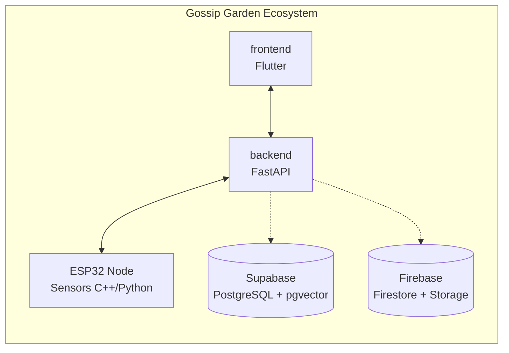
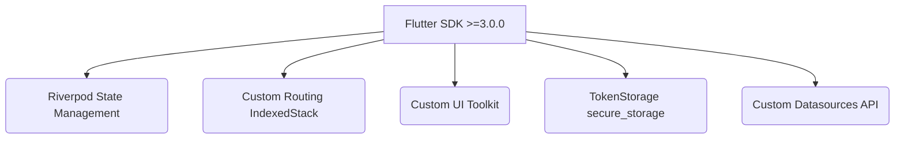
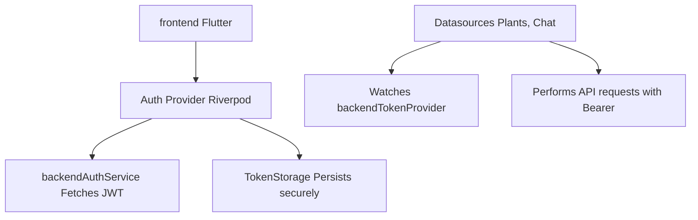

<div align="center">
  
  <h1>Gossip Garden Frontend</h1>
  <p><em>A beautiful, storybook-inspired plant monitoring mobile app.</em></p>

  <p>
    <a href="README.es.md">Leer en Español</a>
  </p>

  
  
  
  
</div>

---

## Table of Contents

1. [Ecosystem Overview](#1-ecosystem-overview)
2. [What Gossip Garden Does](#2-what-gossip-garden-does)
3. [Architecture](#3-architecture)
4. [Tech Stack](#4-tech-stack)
5. [Project Structure](#5-project-structure)
6. [Core Modules](#6-core-modules)
7. [API Integration](#7-api-integration)
8. [Design System](#8-design-system)
9. [Running the App](#9-running-the-app)
10. [Environment Variables](#10-environment-variables)
11. [Building for Production](#11-building-for-production)

---

## 1. Ecosystem Overview

Gossip Garden is an IoT and AI-driven plant monitoring ecosystem consisting of several interconnected components:



| Component | Role |
|---|---|
| **frontend** | The primary user application built in Flutter (this repository). |
| **backend** | FastAPI application handling core business logic, RAG, and AI orchestration. |
| **ESP32 Node** | Hardware sensor that broadcasts real-time telemetry (moisture, light, temperature). |

---

## 2. What Gossip Garden Does

| Feature | Description |
|---|---|
| **Real-time Monitoring** | Streams live sensor telemetry directly to the plant dashboard. |
| **Conversational AI** | Plants have distinct personalities (e.g., Tinto, Oblea). Users chat with them contextually based on their current health and sensor readings. |
| **Plant Identification** | Multi-step UI flow using device camera and image compression to identify plants via AI and GBIF taxonomy. |
| **Health Scoring** | Displays visual indicators of plant health, derived from backend calculations of optimal vs actual conditions. |
| **Custom Navigation** | A specialized UI using an `IndexedStack` to maintain local state, bypassing traditional push routing for a seamless experience. |

---

## 3. Architecture

### Client



### Data Flow



---

## 4. Tech Stack

### Framework

| Layer | Technology |
|---|---|
| Framework | Flutter |
| Language | Dart |
| State Management | flutter_riverpod ^2.0.0 |
| Dependency Injection | Riverpod |
| Routing | Custom `IndexedStack` |

### Key Packages

| Package | Purpose |
|---|---|
| `flutter_riverpod` | Core state management and dependency injection. |
| `firebase_auth` / `google_sign_in` | Third-party authentication (Google). |
| `flutter_secure_storage` | Secure persistence of backend JWT tokens. |
| `http` / `dio` | Network requests to the FastAPI backend. |
| `camera` / `image_picker` | Hardware integration for plant identification. |
| `image` | Local image processing and compression. |
| `google_fonts` | Typography (Quicksand, Nunito). |
| `flutter_animate` | Micro-animations for the UI. |

---

## 5. Project Structure

```text
src/lib/
│
├── core/                             # Shared infrastructure
│   ├── config/                       # Environment and app configs
│   ├── services/                     # Low-level services (API Client, TokenStorage)
│   └── theme/                        # Design tokens (Colors, Typography)
│
├── features/                         # Feature-driven modules
│   ├── auth/                         # Login, Registration, AuthState
│   │   ├── data/                     # DTOs, Auth Services
│   │   └── presentation/             # Screens, Providers
│   │
│   └── plants/                       # Core plant logic
│       ├── data/                     # Models, Repositories
│       └── presentation/             # Dashboards, Chat, Garden View
│
├── widgets/                          # Shared UI components
│
└── main.dart                         # Entry point and global error handling
```

---

## 6. Core Modules

### Auth Lifecycle (`auth_provider.dart`)

Manages the active session state. While Firebase libraries are present, the application bypasses Firebase Auth as the source of truth in favor of direct Supabase token generation via `backend_auth_service`. 
It exposes `backendTokenProvider`, which is reactively watched by all API datasources to ensure requests are always authenticated.

### Navigation (`MainScreen.dart`)

Instead of standard `Navigator.push`, the app uses an `IndexedStack` coupled with a custom `NavigationNotifier` (Riverpod). This approach:
- Preserves the local state of each tab (Dashboard, Chat List, Garden View).
- Overlays specific full-screen views (like `PlantProfileScreen` or `PlantChatScreen`) seamlessly over the tabs.
- Handles system back buttons manually via `PopScope`.

### Plant Identification Flow

Located in the `plants` feature, this flow handles capturing images from the camera, correcting orientation, compressing to 1024x1024, and uploading the data for backend AI processing.

---

## 7. API Integration

The frontend connects exclusively to the `backendGossipGarden` FastAPI service.

| Domain | Protocol | Role |
|---|---|---|
| **Auth** | HTTP/REST | Issues Supabase JWTs, handles Google sign-in handshakes. |
| **Plants** | HTTP/REST | Fetches plant profiles, taxonomies, and care requirements. |
| **Sensors** | HTTP/REST | Streams real-time telemetry from the single ESP32 broadcast node. |
| **Chat** | HTTP/REST | Defers memory and summarization entirely to the backend. |

*Note: The frontend does not use Firebase Firestore for direct data access; all data flows through the backend API to enforce business rules.*

---

## 8. Design System

The application strictly follows the "Crayon Storybook" design system: a paper-like, warm, and playful aesthetic. Emojis are strictly forbidden in UI components.

### Color Palette (`GardenColors`)

| Token | Hex | Usage |
|---|---|---|
| `creamPaper` | `#FAF1DA` | Main background (Warm cream). |
| `creamLight` | `#BFFFFDF5` | Card backgrounds (75% opacity warm white). |
| `ink` | `#3D2817` | Primary dark text, headers. |
| `inkSoft` | `#6B4A2E` | Secondary text. |
| `potOrange` | `#E8A95C` | Warm accents. |
| `leafGreen` | `#8AC553` | Action buttons, success states. |
| `leafDark` | `#5FA037` | Hover states, dark green accents. |
| `heartRed` | `#E85D52` | Error states, alerts. |

### Typography (`GardenTextStyles`)

| Constant | Font | Weight | Usage |
|---|---|---|---|
| `display` | Quicksand | 800 (w800) | Main titles (30px). |
| `title` | Quicksand | 700 (w700) | Section headers (17px). |
| `body` | Nunito | 600 (w600) | Main body text (15px). |
| `label` | Nunito | 700 (w700) | Chips, uppercase labels (11px). |

### UI Conventions

- **Paper Textures:** The root `MaterialApp` wraps all screens in a `Container` with a `PaperTexture.png` background at 40% opacity.
- **Custom Error Widget:** A styled fallback screen replaces the default red screen of death, maintaining the app's branding.

---

## 9. Running the App

### Prerequisites

- Flutter SDK (>=3.0.0)
- Android Studio / Xcode

### Setup

```bash
cd frontendGossipGarden/src
flutter pub get
```

### Run Locally

```bash
flutter run
```

---

## 10. Environment Variables

Create an `.env` file in the `src/` directory:

```env
API_BASE_URL=http://localhost:8000/api/v1
GOOGLE_CLIENT_ID=your-google-client-id
```

---

## 11. Building for Production

### Android

```bash
flutter build apk --release
# For Play Store:
flutter build appbundle --release
```

### iOS

```bash
flutter build ios --release
```
